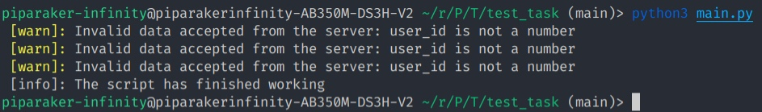
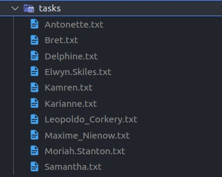
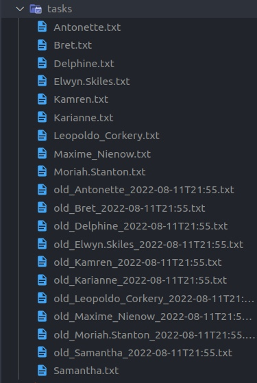

# MedrocketTestTask
Тестовое задание Junior Python разработчик (Django)

## Установка
Для начала нужно клонировать репозиторий в рабочую директорию

```
git clone https://github.com/HexaLopata/MedrocketTestTask.git
```

Создаем виртуальное окружение (команда может отличаться в зависимости от ОС и установленных пакетов)

```
python3 -m venv venv
```

Переходим в созданный каталог  

```
cd MedrocketTestTask
```

Активируем рабочую среду (команда также может отличаться в зависимости от ОС и эмулятора терминала)

```
source ../venv/bin/activate
```

Устанавливаем зависимости

```
pip install -r requirments.txt
```

Теперь скрипт можно запустить

```
python3 main.py
```

## Пример результата скрипта

Скриншот ниже показывает вывод при обращении к данному в условии  api.



В случае возникновения ошибки, она будет выведена на экран красным цветом.

После первого вызова в корне проекта создастся папка "tasks"



После второго вызова файлы перезапишутся, сохранив предыдущий результат.



Примечание: Запуск проводился на системе Linux Mint 20.3 x86_64

## Архитектура

Основная архитектура приложения изображена на рисунке ниже в виде диаграммы классов UML.


Более подробно с ней можно ознакомиться в [файле из папки docs](docs/README.md).