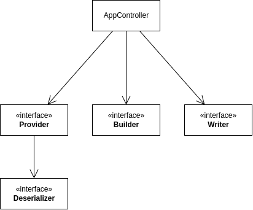

# Архитектура
Основная архитектура приложения.

## AppController

Сущность, которая связывает между собой все остальные в проекте. При этом сама почти не содержит логики. Через нее можно проводить E2E тесты, т.к она содержит в себе все внепроцессорные зависимости.

## Provider

Сущность, которая обеспечивает клиента данными. То есть возвращает валидные объекты модели.

## Deserializer

Сущность, которая валидирует сырые данные и превращает их в полноценный объект модели. Используется APIProvider'ами для десериализации данных, пришедших с сервера.

## Builder

Главная часть бизнес-логики. Эта сущность собирает документ, используя данные, полученные от Provider'ов. На ней сконцетрировано большинство юнит-тестов. Не содержит никаких внепроцессорных зависимостей для упрощения тестирования. Не имеет видимых извне побочных эффектов, а данные отдает как возвращаемое значение, потому что тесты основанные на проверке выходных данных являются самыми эффективными.

## Writer

Сущность, которая взаимодействует с внешними системами (такими как файловая) для записи документов.